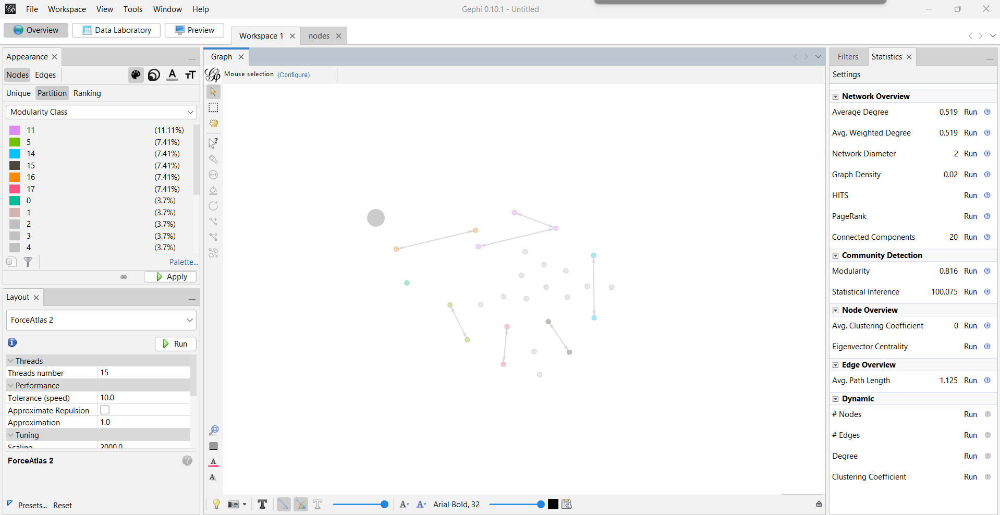
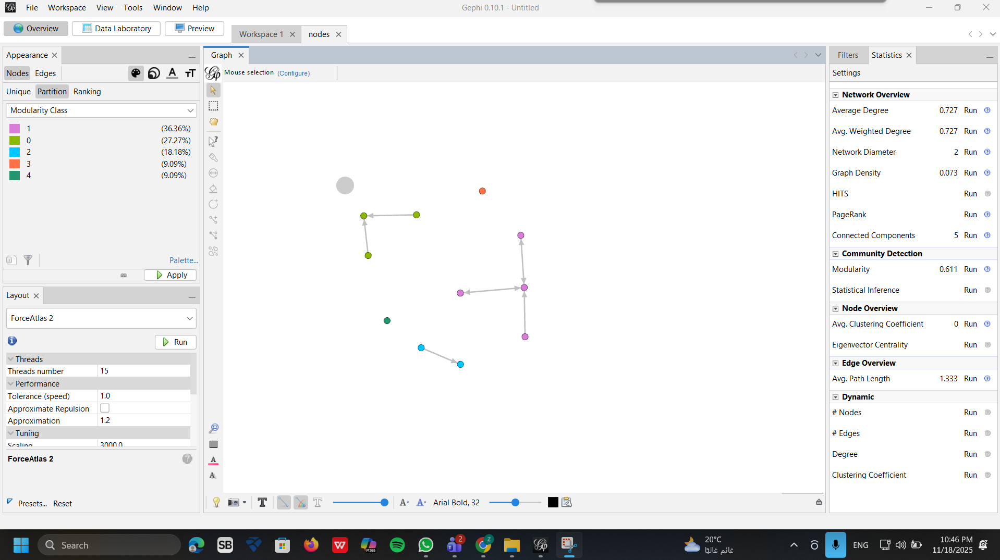

# 🌐 **WICO Network Analysis — 5G Conspiracy vs Non-Conspiracy Twitter Subgraphs**

### **Advanced Social Network Analysis using Gephi**

<p align="center">
  
  
  
  
</p>

---

## 📘 **Overview**

This project performs a **comparative social network analysis** on two Twitter subgraphs extracted from the **WICO Graph Dataset**:

* 🟥 **5G Conspiracy Network** (misinformation cluster)
* 🟦 **Non-Conspiracy Network** (normal organic community)

Both graphs were analyzed using **Gephi**, computing detailed metrics to detect patterns of **misinformation, bot activity, and coordinated amplification**.

---

## 📁 **Project Structure**

```
WICO-Network-Analysis/
│
├── 5G/
│   ├── 5G_nodes.csv
│   ├── 5G_edges.csv
│   ├── graph.csv
│   ├── overview.png
│   └── 5G.pdf
│
├── Non/
│   ├── graph.csv
│   ├── overview.png
│   └── non.pdf
│
├── graphs.gephi
├── report.pdf
└── README.md
```

---

# 🔍 **Visual Graph Previews**

### 🟥 **5G Conspiracy Subgraph**

<p align="center">
  
</p>

---

### 🟦 **Non-Conspiracy Subgraph**

<p align="center">
  
</p>

---

# 📊 **Comparative Findings**

## 🟥 **5G Conspiracy Network (Misinformation Patterns)**

| 🔥 Feature             | Description                                               |
| ---------------------- | --------------------------------------------------------- |
| ❌ Fragmented structure | Many disconnected components → unstable network           |
| ❌ Very low clustering  | Accounts do not interact naturally                        |
| ❌ Weak connectivity    | Edges are minimal and random                              |
| ❌ High modularity      | Artificial segmentation across small groups               |
| 🚨 Security Red Flags  | Bot-like behavior, sockpuppets, coordinated amplification |

This graph shows **classic misinformation architecture**:

> “Isolated nodes forwarding / amplifying content instead of normal conversation.”

---

## 🟦 **Non-Conspiracy Network (Normal User Behavior)**

| ⭐ Feature              | Description                                 |
| ---------------------- | ------------------------------------------- |
| ✔ Strong connectivity  | Nodes linked through multiple relationships |
| ✔ Higher clustering    | Natural group formation                     |
| ✔ Lower modularity     | Communities overlap normally                |
| ✔ Strong central nodes | Organic influence patterns                  |

This graph behaves like a typical Twitter community.

---

# 🧠 **Security & OSINT Interpretation**

The 5G conspiracy graph exhibits nearly all key indicators of **coordinated inauthentic activity (CIA)**:

### 🚩 Indicators Detected:

* Extremely high fragmentation
* Weak edges between nodes
* Low centrality values
* Echo chamber-like communities
* Sparse interaction → indicates automation
* High modularity → micro-clusters often used by bot farms

These characteristics are consistent with:

* 🤖 Botnets
* 🎭 Sockpuppet accounts
* 📣 Amplification rings
* 🌱 Astroturfing campaigns

---

# 🛠 **How the Analysis Was Performed**

### ✔ Step 1 — Import nodes/edges CSVs into Gephi

### ✔ Step 2 — Apply layout (ForceAtlas2)

### ✔ Step 3 — Compute metrics:

* Average degree
* Graph density
* Clustering coefficient
* Connected components
* Modularity (Q)
* Betweenness/Closeness centrality

### ✔ Step 4 — Interpretation & comparison

### ✔ Step 5 — Export visualizations & PDF reports

---

# 📄 **Included Files**

| File                 | Description                              |
| -------------------- | ---------------------------------------- |
| `graphs.gephi`       | The full Gephi project for both networks |
| `report.pdf`         | Final analytical report                  |
| `5G/*.csv`           | Raw data for conspiracy network          |
| `Non/*.csv`          | Raw data for normal network              |
| `overview.png`       | Graph visualizations                     |
| `5G.pdf` / `non.pdf` | Individual graph reports                 |

---

# 📚 **Dataset Source**

**WICO Graph Dataset — Daniel Schroeder (2021)**
A labeled Twitter graph dataset containing misinformation vs non-misinformation subgraphs.

---

# 👤 **Author**

### **Ziad Mahmoud**

Cybersecurity & OSINT Research
WICO Social Network Analysis — 2025


